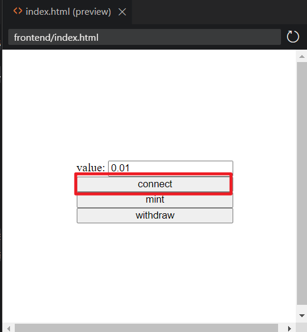
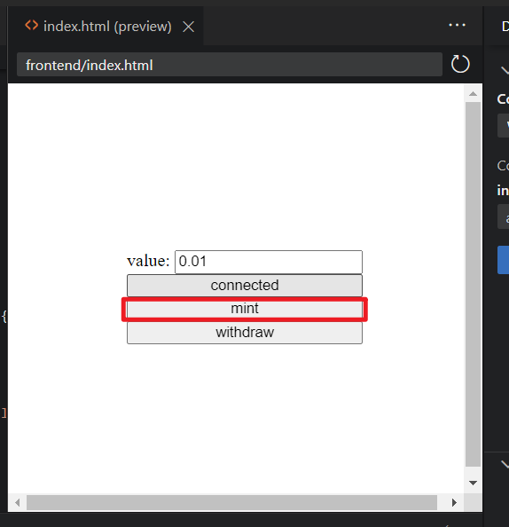
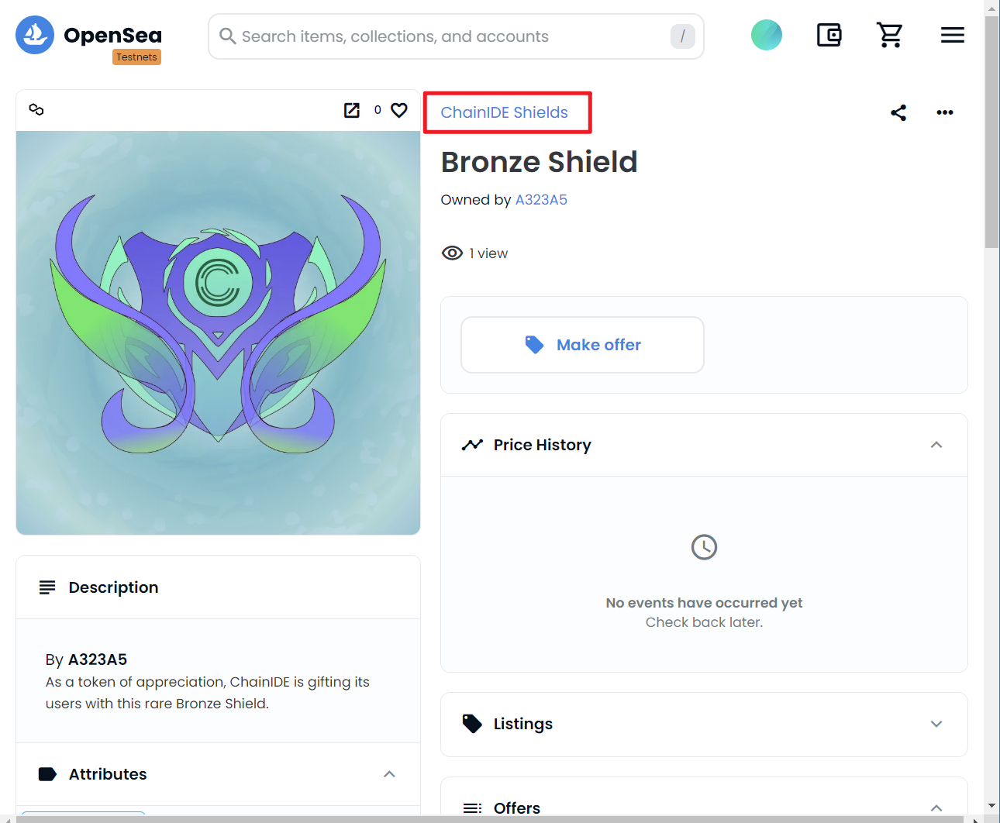
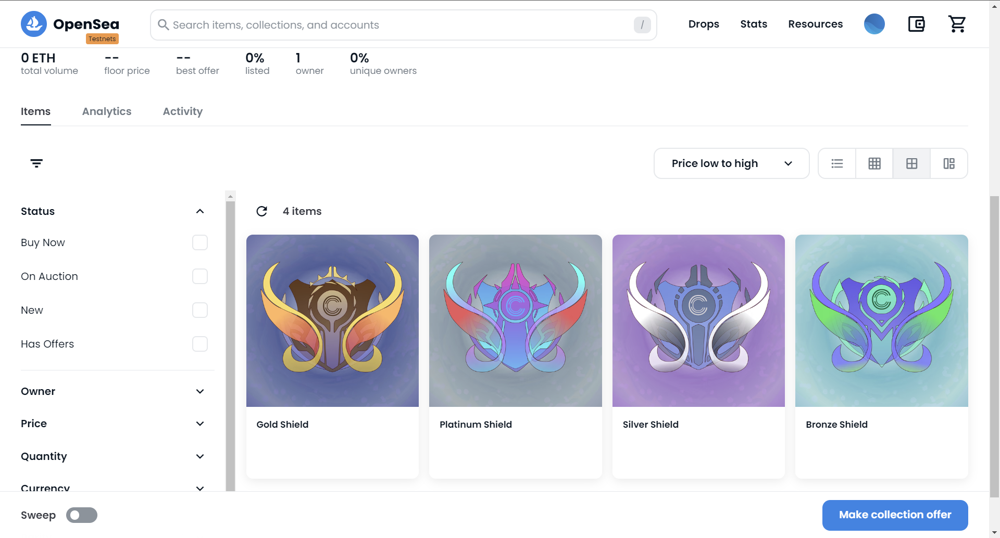
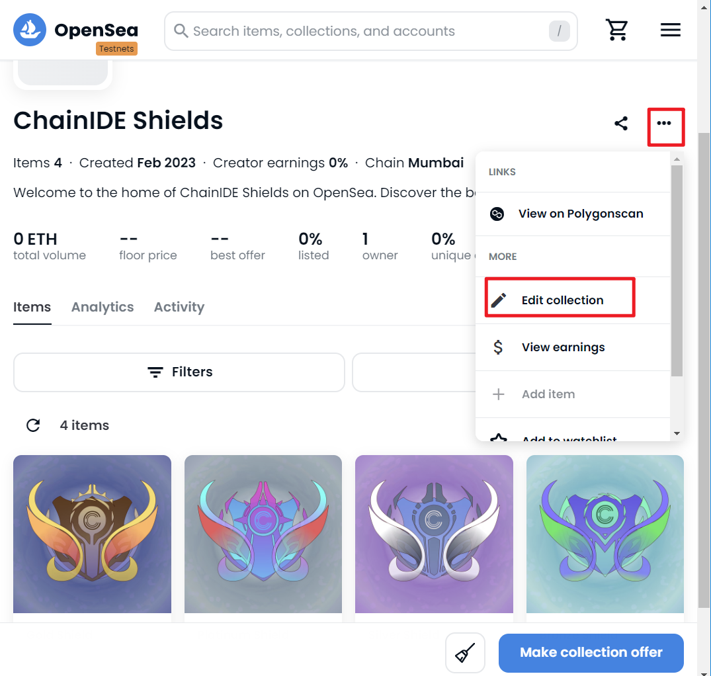
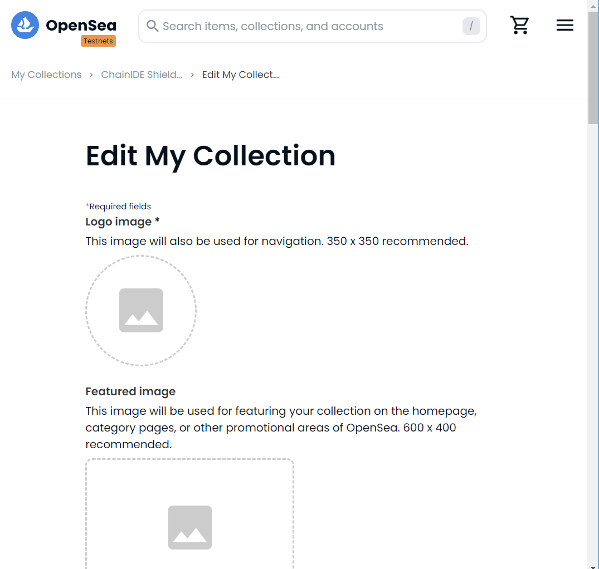
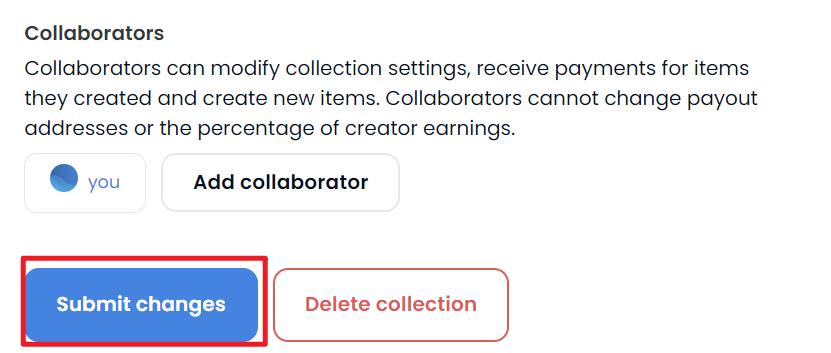

### Minting NFTs for Whitelisted Users

The coding part is finally complete, congratulations! Now it's time to enjoy the results.

Start by clicking `Connect` to link your Metamask account (make sure it's whitelisted).

Next, click "Mint" and a pop-up from MetaMask will appear. Click "Confirm".

After successfully minting, if you are the owner, you can click "Withdraw" to retrieve the tokens from the contract.

Alright, it's time to check out the NFT Collection you've created on OpenSea. Enter the following URL in your browser: `https://testnets.opensea.io/assets/mumbai/0x86b5cf393100cf895b3371a4ccaa1bc95d486a56/1`. Replace "`0x86b5cf393100cf895b3371a4ccaa1bc95d486a56`" with your contract address, and you'll be able to see the first NFT in your Collection.

Click on the "ChainIDE Shields" above, and you'll be able to view the entire content of the Collection.

### Final step, configure the Collection.

If you're the owner, there might be a few additional steps you need to complete. These steps can enhance the appearance of your collection and potentially increase your earnings.

Using the owner account, open the collection page and follow the steps to click on "Edit collection".

You can configure details such as the logo image, description, Twitter link, and more within this section.

One particularly interesting aspect is the "Creator Earnings." Every time a user sells an item from your collection on OpenSea, you can earn a certain percentage of the sale price.

Remember to click "Save" when you're done. You can make multiple changes, so there's no need to worry.

### You did it!

Congratulations! You've completed a full-stack project of an NFT Collection that only allows whitelisted users to mint. You took a significant step toward your web3 journey. I genuinely share your joy in this accomplishment.

However, just as I used to face post-lesson homework back in my student days, I might be passing on some of that challenge to you now, 😁. So, please take a moment to rest and consider the following questions:

* The mint function of the Shield contract allows whitelisted users to directly mint after the owner deploys the contract. Is there a way to modify it so that only after the owner sets permission can whitelisted users mint?
* The mint function of the Shield contract doesn't currently restrict the number of mints per whitelisted user. How can you modify the code to limit each whitelisted user to only one mint?
* If you want to grant minting permissions to everyone after whitelisted users have minted through the Shield contract, how should the code be designed?
* The Whitelist contract uses a mapping to record whitelisted addresses. If the number of addresses exceeds 1000, it could consume a significant amount of gas. What can be done to address this?

These questions might be a bit challenging, but there are hints within the article itself. Stay determined, and I believe your intelligence will guide you to the solutions. If you ever find yourself stuck, feel free to follow us; the upcoming articles will reveal the answers!

Peace!
